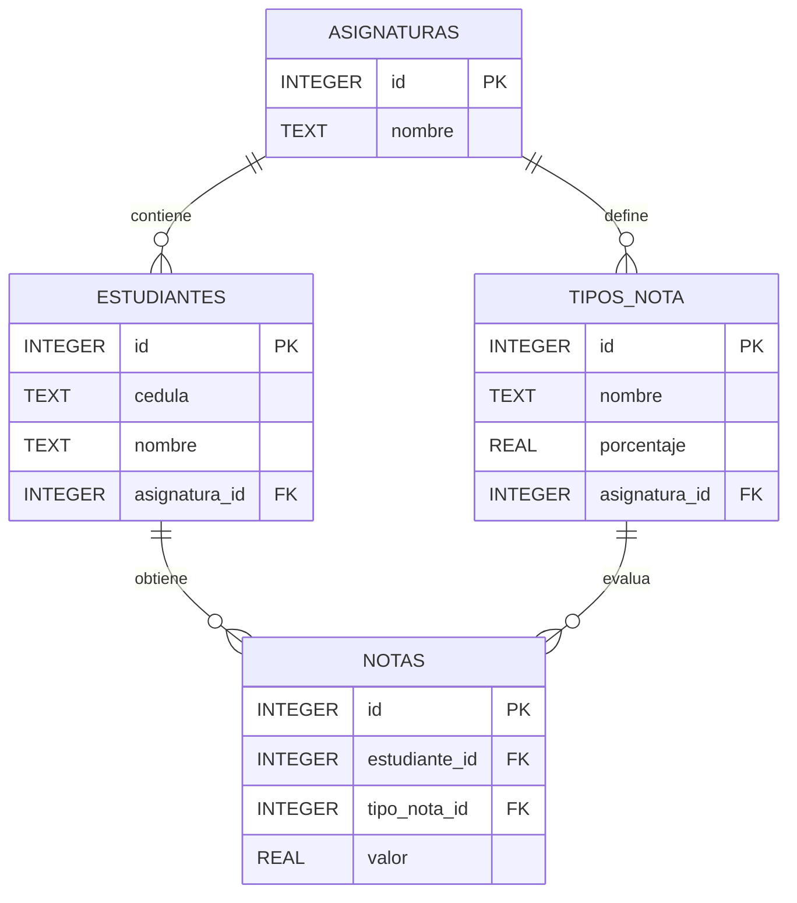

<div align="center">

# 🎓 Sistema de Notas Universitario

**v3.0.0** — *Arquitectura Híbrida con Gestión de Asignaturas*

Aplicación web para gestionar estudiantes y calcular promedios de notas universitarias.


</div>

---

## 📑 Tabla de contenido

- [Descripción](#-descripción)
- [Características](#-características)
- [Tecnologías](#-tecnologías)
- [Estructura del proyecto](#-estructura-del-proyecto)
- [Requisitos previos](#-requisitos-previos)
- [Instalación](#-instalación)
- [Ejecución](#-ejecución)
- [Despliegue con Docker](#-despliegue-con-docker)
- [Uso de la aplicación](#-uso-de-la-aplicación)
- [API REST](#-api-rest)
- [Modelo de datos](#-modelo-de-datos)
- [Solución de problemas](#-solución-de-problemas)
- [Autor](#-autor)

---

## 📖 Descripción

**Sistema de Notas Universitario** es una aplicación web sencilla que permite a un usuario gestionar los datos académicos básicos de estudiantes universitarios: registrar estudiantes, asignarles notas, eliminar la última nota registrada y obtener el promedio de sus calificaciones.
El backend está construido con **Flask** y persiste la información en una base de datos local **SQLite** (`universidad.db`). Esta versión **Híbrida** introduce una arquitectura de múltiples asignaturas y actividades ponderadas, permitiendo un cálculo exacto de promedios basado en porcentajes configurables. El frontend es una SPA (Single Page Application) moderna con navegación por pestañas.

> [!NOTE]
> El archivo `universidad.db` se crea automáticamente y soporta integridad referencial (Foreign Keys).

---

## ✨ Características

- ✅ **Gestión de Asignaturas:** Crea múltiples materias de forma independiente.
- ✅ **Actividades Ponderadas:** Configura actividades (Parciales, Quices, Talleres) con sus respectivos porcentajes (ej. 30%, 20%).
- ✅ **Sistema de Estudiantes:** Registro de alumnos vinculados a asignaturas específicas.
- ✅ **Promedios Ponderados:** Cálculo automático basado en el peso de cada actividad.
- ✅ **Interfaz de Pestañas:** Navegación fluida entre Estudiantes, Calificaciones y Configuración.
- ✅ **Persistencia local** mediante SQLite, sin necesidad de servidor de BD externo.
- ✅ **API REST** simple en formato JSON.
- ✅ **Frontend embebido** servido por la misma aplicación Flask.
- ✅ **UI moderna** con CSS responsive, validaciones y notificaciones *toast*.
- ✅ **Despliegue con Docker** (imagen slim, Gunicorn y volumen para persistir la BD).

---

## 🛠️ Tecnologías

| Capa | Tecnología | Descripción |
|------|------------|-------------|
| Backend | **Python 3.8+** | Lenguaje principal |
| Framework | **Flask 3.x** | Microframework web |
| Servidor WSGI | **Werkzeug** / **Gunicorn** | Werkzeug para desarrollo, Gunicorn para producción/Docker |
| Base de datos | **SQLite 3** | Motor embebido, archivo local |
| Frontend | **HTML5 + CSS3** | Estructura y estilos modernos (gradientes, cards, responsive) |
| Cliente HTTP | **JavaScript (fetch API)** | Llamadas asíncronas a la API |
| Plantillas | **Jinja2** | Motor de templates de Flask |
| Contenedores | **Docker + Docker Compose** | Imagen `python:3.12-slim` |

---

## 📂 Estructura del proyecto

```text
repositorio_kevin/
├── README.md                  # Documentación principal (este archivo)
├── gitignore                  # Patrones ignorados por Git
├── docker-compose.yml         # 🐳 Orquestación del servicio
└── mi_universidad/            # 📦 Aplicación principal
    ├── app.py                 # Backend Flask + SQLite (rutas y lógica)
    ├── requirements.txt       # Dependencias de la app (Flask, Gunicorn)
    ├── Dockerfile             # 🐳 Imagen slim de la aplicación
    ├── .dockerignore          # Exclusiones para el contexto Docker
    ├── universidad.db         # BD SQLite (esquema multi-tabla)
    ├── templates/
    │   └── index.html         # Plantilla Jinja2 del frontend
    └── static/
        ├── css/
        │   └── styles.css     # Estilos modernos
        └── js/
            └── app.js         # Lógica del cliente (fetch + UI)
```

> [!IMPORTANT]
> Toda la aplicación funcional vive dentro de la carpeta [`mi_universidad/`](mi_universidad/). Las dependencias están declaradas en [`mi_universidad/requirements.txt`](mi_universidad/requirements.txt).

---

## ✅ Requisitos previos

Antes de comenzar, asegúrate de tener instalado:

- **Python 3.8 o superior** → [Descargar Python](https://www.python.org/downloads/)
- **pip** (gestor de paquetes de Python, viene incluido con Python)
- Un **navegador web** moderno (Chrome, Firefox, Edge, etc.)

Verifica las versiones desde la terminal:

```bash
python --version
pip --version
```

---

## 📦 Instalación

### 1. Clonar el repositorio

```bash
git clone <URL-del-repositorio>
cd repositorio_kevin
```

### 2. (Opcional pero recomendado) Crear un entorno virtual

<details>
<summary><b>🪟 Windows (CMD / PowerShell)</b></summary>

```bash
python -m venv venv
venv\Scripts\activate
```

</details>

<details>
<summary><b>🐧 Linux / 🍎 macOS</b></summary>

```bash
python3 -m venv venv
source venv/bin/activate
```

</details>

### 3. Instalar las dependencias

```bash
pip install -r mi_universidad/requirements.txt
```

> [!TIP]
> Las dependencias necesarias son **Flask** (servidor web) y **Gunicorn** (servidor WSGI usado en Docker).

---

## ▶️ Ejecución

### Pasos para iniciar la aplicación

```bash
# 1. Entrar a la carpeta de la aplicación
cd mi_universidad

# 2. Ejecutar el servidor Flask
python app.py
```

Una vez iniciado, verás un mensaje similar a:

```text
 * Running on http://127.0.0.1:5000
 * Debug mode: on
```

### Abrir en el navegador

Visita 👉 **[http://localhost:5000](http://localhost:5000)**

### Detener la aplicación

Presiona <kbd>Ctrl</kbd> + <kbd>C</kbd> en la terminal donde se está ejecutando.

> [!WARNING]
> El servidor que viene con Flask (`app.run`) es para **desarrollo únicamente**. Para un despliegue de producción se recomienda usar un servidor WSGI dedicado como **Gunicorn** (incluido en la imagen Docker) o **Waitress** (Windows).

---

## 🐳 Despliegue con Docker

El proyecto incluye un [`Dockerfile`](mi_universidad/Dockerfile) basado en `python:3.12-slim` y un [`docker-compose.yml`](docker-compose.yml) en la raíz que orquesta el servicio con un **volumen persistente** para la base de datos.

### Requisitos

- [Docker](https://docs.docker.com/get-docker/) 20.10+
- [Docker Compose](https://docs.docker.com/compose/install/) v2+

### 1. Levantar el servicio

Desde la raíz del repositorio:

```bash
docker compose up -d --build
```

Esto:

1. Construye la imagen `mi-universidad:latest` a partir de [`mi_universidad/Dockerfile`](mi_universidad/Dockerfile).
2. Inicia el contenedor `mi_universidad` en segundo plano.
3. Expone la app en [http://localhost:5000](http://localhost:5000).
4. Crea el volumen `mi_universidad_data` donde se persiste `estudiantes.db`.

### 2. Comandos útiles

```bash
# Ver logs en vivo
docker compose logs -f

# Reiniciar el servicio
docker compose restart

# Detener y eliminar el contenedor (los datos persisten en el volumen)
docker compose down

# Detener y borrar TAMBIÉN los datos (volumen)
docker compose down -v

# Reconstruir tras cambios de código
docker compose up -d --build
```

### 3. Variables de entorno soportadas

| Variable | Por defecto | Descripción |
|----------|-------------|-------------|
| `PORT` | `5000` | Puerto en el que escucha Gunicorn dentro del contenedor |
| `DB_PATH` | `/data/estudiantes.db` | Ruta del archivo SQLite (en Docker apunta al volumen) |
| `FLASK_DEBUG` | `1` | Solo aplica al modo desarrollo (`python app.py`) |

### 4. Detalles de la imagen

- **Base:** `python:3.12-slim` (~150 MB).
- **Servidor:** Gunicorn con 2 workers, escuchando en `0.0.0.0:${PORT}`.
- **Usuario:** `appuser` (no root) para mayor seguridad.
- **Healthcheck:** `curl` cada 30 s a `GET /`.
- **Persistencia:** la BD vive en `/data` dentro del contenedor, montada como volumen Docker.

> [!TIP]
> Para correr la imagen sin Docker Compose:
> ```bash
> docker build -t mi-universidad ./mi_universidad
> docker run -d -p 5000:5000 -v mi_universidad_data:/data --name mi_universidad mi-universidad
> ```

---

## 🖱️ Uso de la aplicación

La interfaz web se organiza en **3 paneles principales**:

| Panel | Acción | Descripción |
|---|---|---|
| **Estudiantes** | Registro y Listado | Inscribe alumnos en la asignatura seleccionada y muestra sus promedios. |
| **Calificaciones** | Gestión de Notas | Asigna valores a las actividades configuradas para cada estudiante. |
| **Actividades** | Configuración de Pesos | Define el nombre y el porcentaje (peso) de cada evaluación. |

> [!TIP]
> Primero debes crear o seleccionar una **Asignatura** en el menú superior para habilitar la gestión de datos.

---

## 🔌 API REST

Todos los endpoints aceptan/responden en formato **JSON**.

---

### `POST /asignatura` | Crea una nueva materia.
`{ "nombre": "Cálculo Integral" }`

### `POST /tipo_nota` | Define una actividad evaluativa (ej: Parcial) con su peso porcentual.
`{ "nombre": "Examen", "porcentaje": 30, "asignatura_id": 1 }`

### `POST /estudiante` | Registra un alumno en una materia.
`{ "cedula": "123", "nombre": "Juan", "asignatura_id": 1 }`

### `POST /nota` | Guarda o actualiza la calificación.
`{ "estudiante_id": 1, "tipo_nota_id": 5, "valor": 4.5 }`

### `GET /promedio/<id_estudiante>` | Obtiene el promedio ponderado calculado.
Respuesta: `{ "promedio": 4.25 }`

---

## 🗄️ Modelo de datos

La base de datos `universidad.db` (SQLite) utiliza un esquema relacional:



> [!NOTE]
> Las tablas se crean automáticamente al iniciar la aplicación mediante la función `init_db()` en [`app.py`](mi_universidad/app.py).

---

## 🛠️ Solución de problemas

<details>
<summary><b>❌ <code>ModuleNotFoundError: No module named 'flask'</code></b></summary>

Flask no está instalado en el entorno actual. Ejecuta:

```bash
pip install flask
```

Si usas entorno virtual, asegúrate de **activarlo** antes de instalar.

</details>

<details>
<summary><b>❌ <code>Address already in use</code> / puerto 5000 ocupado</b></summary>

Otra aplicación está usando el puerto 5000. Opciones:

1. Cierra la aplicación que lo está usando.
2. Cambia el puerto en `app.py`:

```python
app.run(debug=True, port=5001)
```

</details>

<details>
<summary><b>❌ La base de datos no guarda cambios</b></summary>

Verifica que tienes **permisos de escritura** en la carpeta `mi_universidad/`. El archivo `estudiantes.db` debe poder crearse/modificarse allí.

</details>

<details>
<summary><b>❌ La página no carga estilos o JavaScript</b></summary>

Asegúrate de estar accediendo desde [http://localhost:5000](http://localhost:5000) y **no** abriendo el archivo `index.html` directamente desde el explorador de archivos. Flask sirve los archivos de [`mi_universidad/static/`](mi_universidad/static/) en `/static/...`.

</details>

<details>
<summary><b>❌ El contenedor Docker no arranca o se reinicia</b></summary>

Revisa los logs:

```bash
docker compose logs -f mi_universidad
```

Si el puerto 5000 está ocupado en el host, cambia el mapeo en `docker-compose.yml`:

```yaml
ports:
  - "5050:5000"   # accede en http://localhost:5050
```

</details>

<details>
<summary><b>❌ Perdí los datos al reiniciar el contenedor</b></summary>

Asegúrate de **no** haber ejecutado `docker compose down -v` (la flag `-v` borra el volumen). Para reinicios normales usa solo `docker compose down` o `docker compose restart`.

</details>

---

## 👤 Autor

**Kevin Andrés Garcés Echeverri**

📧 [kevingarces315956@correo.itm.edu.co](mailto:kevingarces315956@correo.itm.edu.co)

🏫 Instituto Tecnológico Metropolitano (ITM)

---

<div align="center">

⭐ Si este proyecto te resultó útil, no olvides dejarle una estrella.

</div>
